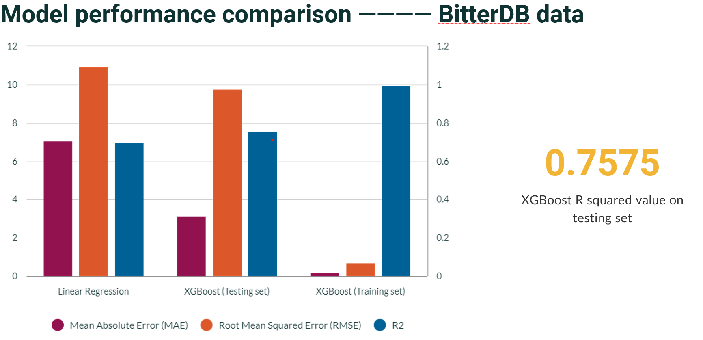
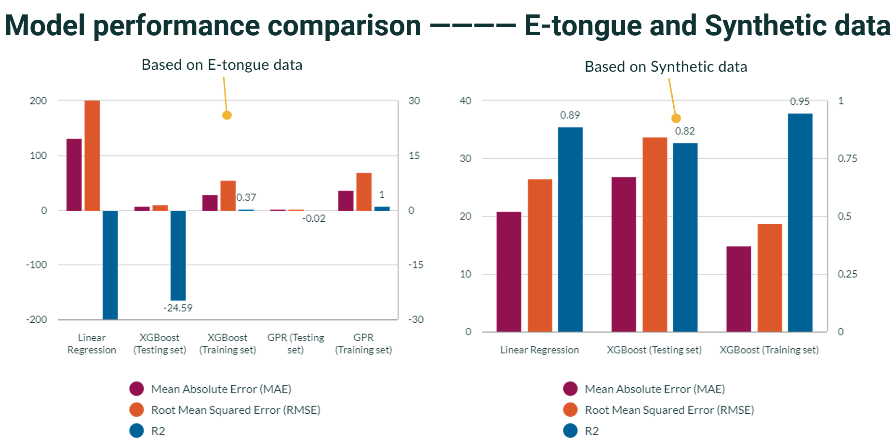
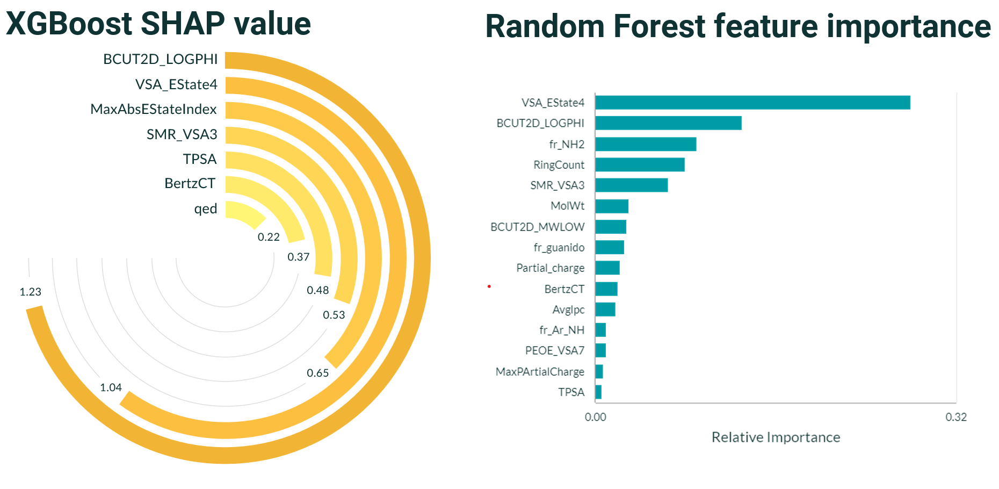

# 🎯 **Bitterness Prediction Using Machine Learning**

This repository contains the code and notebooks related to the research project on predicting the bitterness of drug compounds using machine learning. The project leverages datasets such as BitterDB and e-tongue-generated values, applying various machine learning models to explore the molecular attributes influencing bitterness perception.

---

## 🌟 **Project Overview**

The goal of this project is to predict quantitative bitterness thresholds of drug compounds and analyze important molecular physicochemical properties affecting bitterness. The study employs machine learning techniques like Linear Regression, XGBoost, and Gaussian Process Regression on datasets from BitterDB and synthetic data generated for e-tongue experiments.

### **Key Contributions**:
- ✅ Quantitative prediction of bitterness thresholds using molecular chemical descriptors.
- ✅ Comparison of feature selection methods to identify key descriptors influencing bitterness.
- ✅ Integration of real and synthetic data to enhance model training and evaluation.

---

## 📂 **Repository Contents**

### 1. *Generate Synthetic Data and Prediction Models**
- 🔬 Synthetic data generation for e-tongue experiments using Gaussian Copula Synthesizer (GCS).
- 🤖 Model training on synthetic e-tongue data.
- 📈 Performance evaluation of Linear Regression and XGBoost on synthetic datasets.
- 🔄 Comparison of real e-tongue data and synthetic data.
- 🧠 Insights into the advantages and limitations of data augmentation for machine learning in pharmaceutical research.

### 2. **Models on BitterDB Data**
- 🛠 Data preprocessing for BitterDB dataset.
- 🧬 Feature engineering and selection methods, including Random Forest, SelectKBest, and XGBoost feature importance.
- 🤖 Model building and evaluation using Linear Regression and XGBoost.
- 📊 Feature importance analysis to highlight descriptors such as lipophilicity (BCUT2D_LOGPHI) and molar refractivity (SMR_VSA).

### 3. **Prediction and Feature Selection Models on E-tongue Data**
- 🔍 Data analysis and preprocessing for e-tongue data.
- 📐 Logarithmic transformations to improve data distribution.
- 🤖 Model building and evaluation using Linear Regression, XGBoost, and Gaussian Process Regression.
- 📊 Analysis of e-tongue sensor data to calculate bitterness thresholds for various compounds.

---

## 📊 **Results Summary**

- **BitterDB Models:** XGBoost achieved the best R-squared score of 0.76 for predicting bitterness thresholds.

- **E-tongue Models:** Performance on real data was limited due to small sample size. Synthetic data significantly improved model training and evaluation.

- **Feature Importance:** Key descriptors influencing bitterness include BCUT2D_LOGPHI (lipophilicity) and SMR_VSA (molar refractivity).

---

## 🔮 **Future Directions**
- 🌱 Expand e-tongue datasets for improved model performance.
- 🧠 Explore alternative machine learning algorithms such as Neural Networks and Random Forest.
- 🤝 Integrate bitterness prediction models into pharmaceutical formulation workflows.

---

## 🤝 **Acknowledgments**

Special thanks to Dr. David Shorthouse and Dr. Hend E. Abdelhakim at UCL School of Pharmacy for their supervision and guidance, and to all contributors to the datasets and methodologies used in this project.

